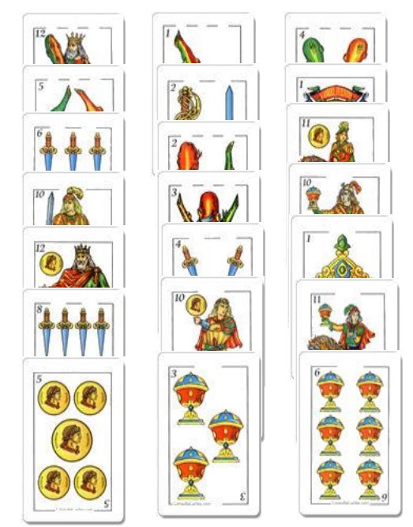
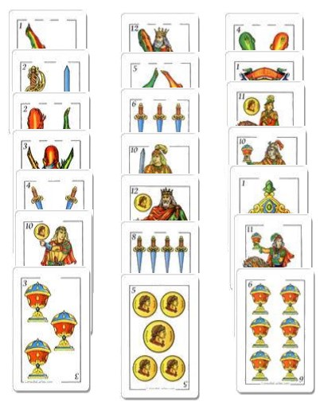
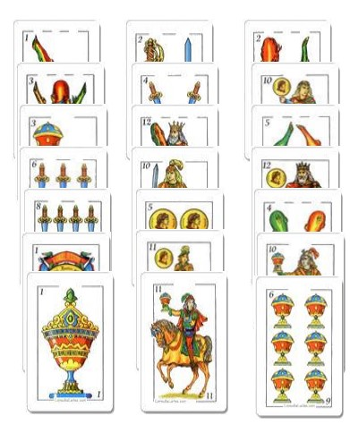

<h1>TRUCO DE LAS 21 CARTAS</h1>

   
    <h2>Descripcion: </h2>
    
Este proyecto plantea el uso de arreglos de forma que se entrene el uso de esta herramienta y se prepare para proyectos de mayor envergadura. A través de este proyecto el/la estudiante aplicará todo lo visto hasta ahora en el curso y utilizará su creatividad para encontrar una solución al problema planteado, mediante la creación de un programa de software.

    <h2>Como se hace el truco:</h2>
    

El truco de 21 cartas (que puede ser hecho con cualquier otro número de cartas que sea múltiplo de 3), funciona de la siguiente manera. El mago, o ejecutor, toma 21 cartas cualesquiera de un mazo común, y las presenta en tres grupos al espectador. Al ser 21 cartas cada grupo queda de 7 cartas:
    

    

    

    
    

    

    
El mago le pedirá al espectador que elija una de esas cartas sin decirle cuál es. Lo único que el espectador tiene que hacer es señalar en cuál de esos tres grupos está la carta que tiene en mente.  
    Imagina por un momento que eres el espectador y el mago te ha presentado las cartas que tienes aquí a la izquierda, tal como se muestran allí. A ti te ha gustado el 5 de oro, que está al final de la primera columna, así que le dices al mago que tu carta está allí, en la columna 1.  
    Lo que el mago hará entonces será juntar las cartas nuevamente en tres montones, pero sin desordenarlas. Así que el primer montón tendrá las 7 cartas que ves en la columna 1 en el orden en que están allí: 12 de basto, 5 de basto, 6 de espadas, 10 de espadas, 12 de oro, 8 de espadas y 5 de oro. Lo mismo con las otras dos columnas.
    

    

    
A continuación el mago juntará los montones en un único mazo pero teniendo la precaución de que el 
    montón que tiene a la carta del espectador quede en medio de los otros dos:

    

    
    

    

    
En este caso entonces, al juntar las cartas en un único mazo quedarán en el orden que se ve a la izquierda.   
    Como ves, el 5 de oro estaría en la posición 14, luego del 8 de espadas. El mago no sabe cuál es nuestra carta, solo hace lo que acabo de decir.  Lo que hará a continuación es volver a mostrar las cartas al espectador en tres montones, pero los repartirá intercalado. Es decir, tomará el mazo y pondrá la primera carta en la columna 1, la segunda en la columna 2, la tercera en la columna 3, luego la cuarta en la columna 1, la quinta en la columna 2, la sexta en la columna 3, y así hasta el final.
    

    
Esto dará como resultado un nuevo arreglo de cartas, tal como se muestra a continuación:

    
  
    
En esta segunda presentación al espectador las cartas han quedado tal como ves a la derecha, siendo esto el resultado del mecanismo en que se ha hecho.

     
    

    
Lo que hará el mago ahora será pedirle al espectador que vuelva a indicar en qué columna o grupo está la carta que ha elegido, siendo obligatorio que la carta elegida en este caso sea la misma que en el anterior, de otro modo esto no tendría sentido.  
    Como habíamos elegido el 5 de oro pues le señalamos al mago que está en el grupo 2. El mago volverá a hacer exactamente lo mismo que antes: juntará las cartas sin desordenarlas en sus tres respectivos grupos. Luego unirá los grupos en un único mazo teniendo la precaución de que el grupo con la carta elegida quede entre medio de los otros dos.   
    En este caso el 5 de oro ya está en el grupo de en medio, con lo cual el mago simplemente junta los montones en ese orden (podría intercambiar los grupos 1 y 3 para confundir más al espectador si así lo quisiera)

    

    

    
    

    
Dado que en este caso dejaremos las cartas como están, su orden será ese mismo. Se puede apreciar que el 5 de oro está en la posición número 12. Al volver a repartir las cartas de forma intercalada (la primera al grupo 1, la segunda al grupo 2, la tercera al grupo 3, la cuarta al grupo 1, y así), tenemos ahora el siguiente arreglo de cartas mostrado al espectador:

     
    

    
Nuevamente, el mago le pedirá al espectador que indique en cuál de los tres montones o grupos está la carta elegida (siendo obviamente la misma que al principio). En nuestro caso podemos ver que el 5 de oro está en el tercer grupo de cartas, así que le indicamos eso al mago.  
    Otra vez se repetirá el proceso: el mago unirá las cartas sin desordenarlas en tres montones, uno por grupo. Luego unirá los montones ubicando aquel con nuestra carta entre medio de los otros dos.
    Mágicamente, al hacer eso el 5 de oro quedará en la posición número 11 (justo en medio) del mazo. Eso será así de forma indiscutible y funcionará siempre para cualquier carta que el espectador haya elegido, siempre que se hayan seguido estas sencillas reglas.  
    Lo único que tienes que hacer para adivinar la carta es contar las cartas y sacar la número 11. Como ves, la matemática es mágica.

    

    

    
    

    <h2>Pasos a Seguir</h2>
    
-1. Generar letras al azar sin repetir en deck: Dedicamos una clase completa a mostrar cómo generar números al azar sin repetir en un arreglo. Esto es exactamente lo mismo. 
    -2. Asignar a los 3 grupos sus 7 cartas: Esto es simple, se recorre el arreglo deck hasta el final. Las primeras 7 celdas se copian a grupo1, las otras 7 a grupo2 y las últimas 7 a grupo3. 
    -3. Se entra en un bucle repetitivo:  
        <pre>I. Se muestran los 3 grupos en pantalla intercalando las letras de modo que cada grupo aparezca en una columna. Esto se logra simplemente imprimiendo los tres arreglos a la vez, primero la celda de grupo1, luego la de grupo2 y finalmente la de grupo3. </pre>
        <pre>II. Se entra en un bucle para pedir el número de grupo. Si la opción ingresada no es correcta (1, 2 o 3) se repite este bucle. </pre>
        <pre>III. Según la opción ingresada se vuelven a poner los grupos en deck manteniendo el orden de sus letras, de forma que el grupo en que está la letra elegida quede en medio. Primero se pone un grupo de la celda 1 a la 7, luego el otro de la celda 8 a la 14 (en este está la letra elegida) y finalmente el último grupo de la celda 15 a la 21. </pre>
        <pre>IV. Se vuelven a mover las letras a los grupos de forma intercalada. </pre>
        <pre>V. Se repite el bucle desde el punto 3 hasta agotar la cantidad de repeticiones (3).  </pre>
    4. Se muestra al usuario la letra seleccionada, que es la celda central del arreglo deck.
    

  

    <h2>Restricciones en el codigo</h2>
    
Para este proyecto tienes que utilizar las constantes y variables definidas arriba tal cual se te han indicado (básicamente copia y pega). Además tienes las siguientes restricciones:  
    <pre>➢ No puedes declararte ningún otro tipo de datos, clase ni utilizar librerías de Java que no se hayan visto en el curso.</pre>
    <pre>➢ No puedes declarar nuevas constantes.</pre>
    <pre>➢ Debes utilizar las constantes ya definidas para tus bloques FOR, WHILE o REPEAT que utilices para recorrer arreglos.</pre>
    <pre>➢ Todo tu código debe estar dentro del procedimiento main de tu clase principal. No puedes declarar nada fuera del procedimiento main.Puedes declararte tantas variables como quieras y utilizar el algoritmo que quieras. Los pasos dados en la sección anterior simplemente son una sugerencia para ayudarte, pero no es algo a lo que te tengas que atener de forma restrictiva. </pre>
    Cualquier otra facilidad de Java no será admitida en este proyecto
    

